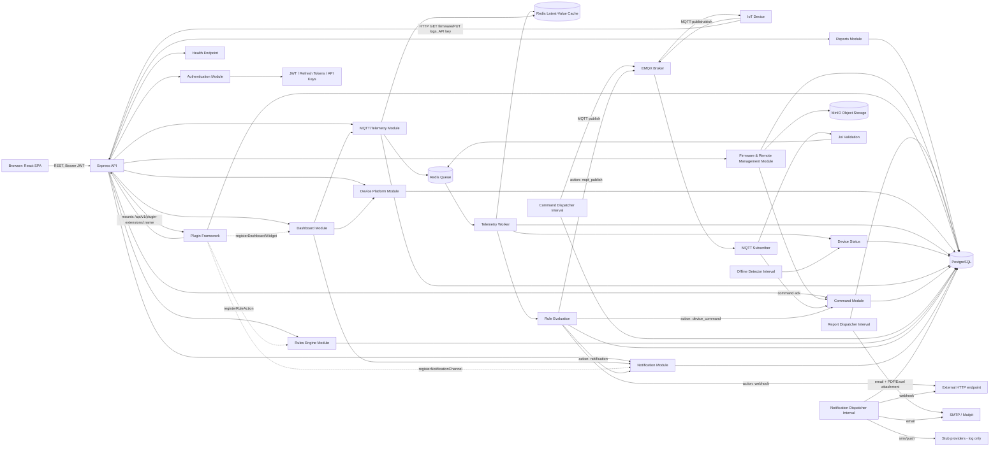

# Architecture

## Overview

The platform is organized around a modular backend service that can be deployed as a self-contained single-tenant instance. Phases 1-4 established the HTTP API foundation, authentication/RBAC, and the device hierarchy (Site → Asset → Device → Sensor). Phase 5 added the real MQTT telemetry (uplink) platform: EMQX-backed ingestion, Redis-queued processing, PostgreSQL-backed historical storage, and online/offline detection. Phase 6 added the downlink counterpart: a Command Platform that sends commands to devices, tracks their lifecycle, retries on missing acknowledgement, and records device responses. Phase 7 added a generic Rules Engine that evaluates conditions against incoming telemetry and triggers actions (webhook, MQTT publish, device command, notification), with versioned rule definitions and execution history. Phase 8 added the Notification Platform behind the Rules Engine's `notification` action: Alerts with multi-level Escalation, Email/SMS/Push/Webhook delivery interfaces, message Templates, and a persistent Retry Queue. Phase 9 added the Dashboard Platform — a backend `Dashboards` module plus, for the first time, a real frontend: a React+Vite SPA (`frontend/`) that renders configurable widgets (chart, gauge, map, status card, alarm list) backed by the existing telemetry/device/alert APIs. Phase 10 added Reports & Analytics — saved aggregation queries over historical telemetry with trend analysis, alert/command KPI summaries, PDF/Excel export, and calendar-scheduled email delivery. Phase 11 added Firmware & Remote Management (OTA distribution/rollback, remote configuration, diagnostics, and log collection) by extending the Command Platform with new command `type`s rather than building a parallel downlink mechanism, and brought MinIO online for the first time to store firmware binaries and collected device logs. Phase 12 added a Plugin Framework — a loader, manifest format, lifecycle, and API/SDK letting industry-specific logic (agriculture, industrial automation, etc.) register new Rule actions, Notification channels, Dashboard widgets, and API routes from outside the core codebase, proven by a sample agriculture plugin. Phase 13 hardened the platform for real production operation — tiered rate limiting, liveness/readiness health checks, Prometheus metrics and a Grafana dashboard, backup/restore scripts and a disaster-recovery runbook, targeted performance fixes, container hardening, and a manual security review that found and fixed several real issues (a log-redaction gap, SSRF exposure in both webhook features, and — most seriously — three shared infrastructure clients with no error listener, meaning a routine Redis/MQTT/Postgres hiccup could crash the entire process). Phase 14 packaged the platform for a real cloud rollout — a production Docker Compose topology, a TLS-terminating Nginx (finally resolving a Phase 9 placeholder), Cloudflare Origin Certificate-based SSL, CI/CD image publishing to GHCR, and a health-check-gated deployment/rollback script — built once as a provider-agnostic "any Linux host with Docker" path rather than six separate cloud integrations. Phase 15 proved the platform's industry-agnostic core claim for real: five example verticals (Agriculture, Industrial Automation, Energy, Water, Healthcare) built entirely from device templates, rules, dashboards, reports, and plugins, with zero changes to `src/`.

## Principles

- Clean separation between routes, services, repositories, and shared infrastructure
- Environment-driven configuration
- Secure defaults and request validation
- Testability for each module (unit tests + integration tests against real Postgres/Redis/EMQX/SMTP)

## Module Map

## Telemetry Pipeline (uplink)

Device → EMQX → MQTT Subscriber → Joi Validation → Redis Queue → Telemetry Worker → PostgreSQL (`telemetry_history`) + Redis (latest-value cache) + `device_status` + Rule Evaluation.

A REST fallback (`POST /api/v1/mqtt/telemetry`, `POST /api/v1/mqtt/heartbeat`, gated by API key + `ingest_telemetry` permission) feeds the identical pipeline for clients that cannot publish over MQTT directly.

Offline detection runs as a per-process interval sweep (see `src/modules/mqtt/offline-detector.js`) that flips a device's status to offline once `last_seen_at` exceeds `OFFLINE_THRESHOLD_MS`. This is documented as a TODO to move into the charter's future Scheduler module once a multi-instance deployment model is introduced.

## Command Pipeline (downlink)

`POST /api/v1/commands` (gated by `send_commands` permission) validates the request, confirms the target device exists, and inserts a `device_commands` row with status `pending`. A per-process interval sweep (`src/modules/commands/dispatcher.js`, same shape as `offline-detector.js`) polls PostgreSQL for due/retry-due rows and publishes them to `devices/{deviceId}/commands` over MQTT, moving the row to `sent`.

The device acknowledges by publishing to `devices/{deviceId}/commands/ack` (`{commandId, status: 'success'|'failure', response}`), handled by the same MQTT subscriber used for telemetry/heartbeat. A REST fallback (`POST /api/v1/commands/:commandId/ack`, gated by API key + `ack_commands` permission) exists for devices that cannot publish MQTT directly. Acknowledgement is idempotent — only rows still in `sent` status are updated, so duplicate or late acks are safely ignored.

If no acknowledgement arrives within `COMMAND_ACK_TIMEOUT_MS`, the same dispatch sweep republishes the command (incrementing `attempts`) up to `max_attempts`, after which the command is marked `expired`. `device_commands` doubles as both the live dispatch queue and the command history (`GET /api/v1/commands/devices/:deviceId`, `GET /api/v1/commands/:commandId`) — there is no separate event-log table, mirroring how `telemetry_history` serves the same dual role in the telemetry pipeline.

## Rules Engine

Rule evaluation is invoked synchronously at the end of `processTelemetryJob` (`src/modules/mqtt/services/mqtt-service.js`), wrapped in its own try/catch so a rules bug can't take down telemetry processing. For each active rule matching the telemetry's device (`rules.device_id = deviceId` or `NULL` for a global rule), its `conditions` (`{field, operator, value}`, dot-path lookup into the payload) are evaluated and combined via `condition_logic` (`all`=AND, `any`=OR).

On a match, each configured action is executed through a pluggable registry (`src/modules/rules/actions/`) — `webhook` (real HTTP POST, `RULE_WEBHOOK_TIMEOUT_MS` timeout), `mqtt_publish` (real publish via the shared MQTT client, supports `{deviceId}` topic templating), `device_command` (calls the Command Platform's `createCommand` directly), `notification` (**real as of Phase 8** — creates an Alert via the Notification Platform; see below). Each action is individually try/caught; results (success/error) are recorded in `rule_history` alongside the triggering payload.

**Rule Versioning**: every `PUT /api/v1/rules/:ruleId` snapshots the rule's current row into `rule_versions` before applying the update and increments `rules.version`. Full history via `GET /:ruleId/versions`.

**Rule Testing**: `POST /api/v1/rules/:ruleId/test {payload}` runs the same condition-evaluation logic against a supplied sample payload and reports per-condition results and which actions *would* run — no actions are executed and no history/version rows are written.

There is no hard delete for rules (avoids an FK-cascade-vs-audit-trail conflict with `rule_history`/`rule_versions`) — a rule is deactivated via `PUT` with `enabled: false`.

## Notification Platform

An **Alert** (`alerts` table) is the logical event; a **Notification Delivery** (`notification_deliveries`) is one send attempt to one recipient over one channel — the Retry Queue operates on deliveries, not alerts. Unlike the Rules Engine's synchronous inline actions, alert dispatch is genuinely asynchronous: `createAlert` only inserts rows (`status='pending'`, `next_attempt_at=now()`); a `setInterval` dispatcher (`src/modules/notifications/dispatcher.js`, same shape as the command dispatcher) drains them.

**Escalation**: `alerts.escalation_policy` is a jsonb array `[{delayMs, channels: [{type, recipient}]}, ...]`. Index 0 is dispatched immediately at creation (`escalation_level=0`); if a later level exists, `next_escalation_at` is set. The same dispatch sweep also advances escalation for `active` alerts past `next_escalation_at`, dispatching the next level's channels and recomputing `next_escalation_at` (or clearing it once there are no more levels). `POST /api/v1/notifications/alerts/:alertId/ack` sets `status='acknowledged'` and clears `next_escalation_at`, halting further escalation — same idempotent-guard style as command acknowledgement.

**Retry semantics differ from the Command Platform**: commands retry on *silence* (no ack within a timeout); notification deliveries retry on *synchronous send failure* (SMTP/webhook error) — a due delivery is attempted immediately, and on failure either scheduled for retry (`next_attempt_at = now() + NOTIFICATION_RETRY_BACKOFF_MS`) or marked terminally `failed` once `max_attempts` is exhausted.

**Channels** (`src/modules/notifications/channels/`, pluggable registry like the Rules Engine's action registry): `email` (real, `nodemailer` → SMTP → Mailpit in dev), `webhook` (real, HTTP POST via global `fetch` + timeout), `sms`/`push` (**documented stubs** — no Twilio/FCM credentials exist; they log and resolve successfully since there's no real failure mode to simulate, so they never occupy the retry queue).

**Templates**: `notification_templates` (`name`, optional `channel`, `subject_template`, `body_template`) rendered with a small `{{path.to.value}}` dot-path substitution (same style as the Rules Engine's `getFieldValue`, no templating dependency). An alert with a `template_id` + `template_data` renders through the template; otherwise its raw `title`/`message` is used directly.

`alerts.device_id`/`alerts.rule_id` use `ON DELETE SET NULL` (not `CASCADE`, unlike telemetry/commands) — alerts are an audit trail and should outlive the device/rule that triggered them.

**Scope for this phase**: alert sources are the Rules Engine's `notification` action and a direct `POST /api/v1/notifications/alerts` for manual/external triggers. Device-offline (Phase 5) and command-expiry (Phase 6) are not auto-wired to alerts.

## Dashboard Platform

The first phase to introduce a frontend. `src/modules/dashboards/` follows the same backend architecture as every other module (routes/services/repositories/Postgres); `frontend/` is a separate React+Vite SPA that consumes it (and the devices/mqtt/notifications APIs) over REST with a Bearer JWT.

**Data model**: `dashboards.layout` is a jsonb array of widget objects `{id (client-generated string), type, title, position:{x,y,w,h}, config:{...type-specific}}`. Updates are a whole-layout replace via `PUT /:dashboardId` — no granular per-widget endpoints, no versioning (unlike Rules). `dashboard_templates` holds reusable starting layouts; `POST /templates/:templateId/instantiate` copies a template's layout into a new dashboard. Both `dashboards`/`dashboard_templates` use plain hard delete — nothing else has an FK on them, unlike the audit-trail dilemma that ruled out hard delete for rules/alerts.

**Widget types**: `chart` (→ `getHistoricalTelemetry`), `gauge` (→ `getLatestValues`), `status_card` (→ `getDeviceStatus`), `alarm_list` (→ `listAlerts`), `map` (→ device `metadata.location.{lat,lng}`, reusing the existing flexible `devices.metadata` jsonb column rather than a new schema column — devices without a location are simply omitted). `GET /:dashboardId/data` resolves every widget in one call; each widget's resolution is individually try/caught so one broken widget (e.g. referencing a deleted device) can't blank out the whole dashboard.

**Frontend** (`frontend/`, React + Vite, Recharts for charts/gauges, `react-leaflet`/Leaflet for maps): JSON-configured layout with simple add/remove-widget forms — no drag-to-move/drag-to-resize. `DashboardViewPage` polls `GET /:dashboardId/data` on a 5s interval. The API client (`src/api/client.js`) attaches the Bearer access token and silently retries once via `POST /api/v1/auth/refresh` on a 401 before redirecting to `/login`. In development, Vite's dev server proxies `/api` to the Express backend (`vite.config.js`); in production, `frontend/Dockerfile` (multi-stage: Node build → Nginx serve) and `frontend/nginx.conf` serve the static build and proxy `/api/` to the backend — the proxy upstream hostname is a documented placeholder since no production compose/orchestration topology exists yet. The frontend has no automated test framework in this phase (no Vitest/RTL/Playwright); verification was manual, driving the real dev servers in a headless browser.

**Auth addition**: `POST /api/v1/auth/refresh` was added to the (already-complete) auth module specifically to support the SPA's session — access tokens expire in 15 minutes and previously had no renewal path.

## Reports & Analytics

A **Report** (`reports` table) is a saved query definition, analogous to a Dashboard's saved widget layout: a device scope (`device_ids`, empty = fleet-wide), a list of telemetry **metrics** to aggregate (`{field, label, aggregation}` — `field` is the same dot-path convention as widget/rule payload lookups; `aggregation` ∈ `avg|min|max|sum|count`), whether to include the alert/command KPI summary blocks, a `bucket_interval` (`hour|day|week`), and a `period_days` default window.

**Aggregation is real SQL**, not application-level math: `date_trunc($interval, received_at)` grouping on `telemetry_history`, extracting the numeric metric via `(payload #>> path::text[])::numeric`. `bucket_interval`/`aggregation` are whitelisted through Joi `.valid(...)` before reaching SQL. `GET /:reportId/data` (`src/modules/reports/services/report-service.js`) resolves every metric's bucketed series plus a **trend** block — `{current, previous, changePercent}` — by running the same aggregate query over the requested period and the immediately-preceding period of equal length; this is the entirety of "Trend Analysis," no separate subsystem. The alert-summary and command-summary KPI blocks reuse existing data (`alerts` grouped by `severity` with average acknowledge time, `device_commands` grouped by `status`) — no new tracking tables.

**Export**: `src/modules/reports/services/export-service.js` renders the already-resolved `/data` JSON into a `Buffer` via `pdfkit` (programmatic PDF — tables and KPI lines, not chart screenshots, consistent with this backend having no headless-browser dependency anywhere) or `exceljs` (one workbook sheet per metric plus a `Summary` sheet). `GET /:reportId/export?format=pdf|excel` streams the buffer directly; nothing is persisted to disk or object storage.

**Scheduling** (`report_schedules`) uses frequency presets (`daily`/`weekly`/`monthly` + `hour_of_day`/`day_of_week`/`day_of_month`) and a computed `next_run_at` — plain JS date math (`computeNextRunAt`), no cron-expression dependency. A `setInterval` dispatcher (`src/modules/reports/dispatcher.js`, same shape as the command/notification dispatchers) polls for due schedules, generates the export, and emails it as an attachment to each recipient (`sendEmail` was extended to accept `attachments`, passed straight through to `nodemailer`) — scheduled runs are the only way a generated report file leaves the process; ad-hoc `/export` calls stream directly to the caller. Every scheduled run — success or failure — is recorded in `report_runs` (status/error/recipients/timestamp), giving Scheduled Reports a visible history without persisting the files themselves.

**Frontend**: `frontend/src/reports/` mirrors the Dashboards pages — a list/create page, a view page (KPI blocks + per-metric tables + Download PDF/Excel buttons using a new `apiDownload`/`triggerBlobDownload` pair in the API client for blob responses), an edit page (add/remove metrics, same list-form pattern as the dashboard widget editor), and a schedules page (create/delete schedules, view run history).

## Firmware & Remote Management

Every deliverable in this phase — OTA distribution, rollback, remote configuration, diagnostics, log collection, reboot — is a **new `device_commands.type`** riding the existing Command Platform (Phase 6) rather than a parallel downlink mechanism: no new MQTT topics, no new dispatch/retry logic, no changes to the mqtt module. `src/modules/firmware/` adds thin domain-specific tables/services on top.

**No denormalized status.** `device_commands.status` stays the single source of truth. `firmware_deployments` is a join table (`device_id, firmware_id, command_id, is_rollback`) — "current firmware" and "deployment status" are derived live by joining to `device_commands`, never duplicated. **Rollback** finds the most recent deployment whose command is `acknowledged`, then the one before it, and redeploys that `firmware_id` — no separate rollback machinery.

**Command ack hooks**: a small pluggable registry (`registerAckHook(type, handler)` in `src/modules/commands/services/command-service.js`, the same shape as the Rules Engine's action registry / Notification channel registry) lets other modules react to a specific command `type` being acknowledged without the commands module importing them. The firmware module registers exactly one hook — `config_update` writes the device's `reported_config`/`reported_version` (`device_configurations`, a desired/reported device-shadow pair mirroring AWS IoT Device Shadow / Azure IoT Hub twins) from the ack's response. `firmware_update` needs no hook (state is read live from `device_commands` via the join above); `collect_logs` needs no hook either — see below.

**OTA delivery is HTTP pull, not MQTT chunked transfer.** A `firmware_update` command's payload carries `{firmwareId, downloadUrl, version, checksum, sizeBytes}`; the device does an authenticated `GET /api/v1/firmware/:firmwareId/download` (backend streams from MinIO) and acks when done. **Log collection is two independent events**, not one: the `collect_logs` command prompts the device, but `log_collections.status` (`requested` → `uploaded`) is set only by the device's subsequent `POST /api/v1/devices/:deviceId/logs/:collectionId/upload` — an event the command ack itself doesn't carry.

**Object storage**: this is the first phase to wire up real MinIO (`src/shared/storage.js`, on the `minio` npm package) — every prior phase left it a stub because nothing needed file storage. One bucket (`config.minio.bucket`), key-prefixed (`firmware/{deviceType}/{version}/...`, `logs/{deviceId}/{collectionId}/...`). Devices never talk to MinIO directly — every upload/download is proxied through an authenticated Express route (`multer`, memoryStorage, size-capped via config), consistent with the fact that devices never talk directly to Postgres/Redis/MinIO anywhere else in this platform, only MQTT and the Express API.

**Permission reuse, no new roles-map entries.** Firmware registry upload → `manage_devices`; deploy/rollback/config-push/diagnostics-request/log-request/reboot → `send_commands` (identical gate to `POST /api/v1/commands`, since that's what they are under the hood); device-initiated firmware download / log upload → `authenticateApiKey` + `ack_commands`; reads → `read`. `src/modules/auth/services/auth-service.js` was not touched this phase.

**Frontend**: `frontend/src/devices/` (a device list page — none existed before this phase — and a per-device management panel covering firmware/config/diagnostics/logs/reboot) and `frontend/src/firmware/` (registry list + upload form, using a new `apiUpload` FormData helper in the API client).

## Plugin Framework

This is the phase where industry-specific logic starts living **outside** the core codebase, plugged in rather than merged in — the charter's explicit purpose for it. `src/plugins/` is the framework; `plugins/` (repo root) holds the actual plugins, one directory each, each with a `plugin.json` manifest (`name`, `version`, `description`, `main`) validated by Joi.

**In-process, not isolated.** Plugins are trusted local Node modules, dynamically `import()`ed into the same process and given a scoped API object — the same trust model as Fastify/ESLint/Babel plugins, appropriate for a single-tenant deployment with operator-installed plugins rather than a marketplace running untrusted third-party code. No child-process/worker RPC layer was built.

**Extension surface reuses existing pluggable registries.** Rule actions (`src/modules/rules/actions/index.js`) and Notification channels (`src/modules/notifications/channels/index.js`) already had a `{type: handlerFn}` shape from Phases 7-8; this phase just added `registerX`/`unregisterX` pairs to each (mirroring Phase 11's `registerAckHook` precedent). Dashboard widget resolution (Phase 9) was a hardcoded `switch` — refactored into the same `widgetResolvers` map shape with its own `registerWidgetResolver`/`unregisterWidgetResolver`. Every `registerX` throws on a name collision (built-in or another plugin) rather than silently overwriting.

**A necessary validation change**: the `type`/`channel` fields on rule actions, notification channels, and dashboard widgets were previously Joi `.valid('webhook', 'mqtt_publish', ...)` whitelists — baked in at module load, before any plugin could possibly exist. An open, plugin-extensible type namespace is fundamentally incompatible with a static whitelist, so all three relaxed to `Joi.string().min(1)`. Enforcement moved to where it already effectively happened — `executeAction`/`sendViaChannel` already threw "Unknown type" at evaluation time; the widget lookup already fell back to `null`. Net effect: a rule referencing a not-yet-loaded plugin action is now accepted at creation time and fails per-action at evaluation time (already-existing try/catch, recorded in `rule_history`) instead of being rejected at creation time.

**Lifecycle is 3 real states** (`plugins` table): `active`, `disabled`, `error`. A plugin with a valid manifest is always attempted-active immediately on discovery (auto-enable), persisted across restarts once an operator disables it. Disabling is real, not cosmetic: `createPluginApi` tracks every `registerX` call a plugin makes, and `disablePlugin` calls the plugin's `deactivate()` hook (if any) then walks that list calling the matching `unregisterX` for each — a disabled plugin's rule actions/channels/widgets genuinely stop resolving. Plugin-owned Express routes can't be truly unmounted, so each plugin's router is wrapped once (at first activation) by a small always-mounted gate middleware checking a live in-memory status flag, returning `503` when disabled — mounted at `/api/v1/plugin-extensions/:pluginName/*`, a different prefix from the management API (`/api/v1/plugins`) to avoid path-shape ambiguity.

**SDK vs. API are deliberately different surfaces.** The SDK (`#plugin-sdk`, a Node `package.json` `"imports"` subpath alias — no new dependency) is authoring sugar imported at a plugin's module top level: `definePlugin(config)` plus JSDoc typedefs for editor autocomplete (this project has no TypeScript). The API is the capability object passed into `activate(api)`: the three `registerX` methods, an Express `router`, a prefixed `logger`, `auth` (the existing `authenticate`/`requirePermission`/`authenticateApiKey` middleware, so plugins don't need fragile relative imports into `src/`), and curated helpers (`createDeviceCommand`, `getLatestTelemetry`, `getFieldValue`) for actually doing something with what a plugin registers.

**Loading happens in `server.js`**, not `app.js` — `await loadAndActivatePlugins(app)` runs after `storageClient.ensureBucket()`, before the dispatchers, matching the migrations/bucket-creation startup sequence. Tests call the same exported function directly in their own setup, the same "call the real processing function explicitly" convention every dispatcher's tests already follow.

**Permission**: `manage_plugins` was added to `admin` only — deliberately **not** `manager`, breaking the pattern every prior module followed, because enabling/disabling arbitrary loaded code is materially more sensitive than the domain-management permissions granted to `manager` elsewhere.

**Sample plugin**: `plugins/sample-agriculture-plugin/` — an `irrigation_command` rule action (sends a real device command) and a `soil_moisture` dashboard widget, explicitly labeled a reference implementation. It's the live proof that industry logic (here, agriculture) needs zero core-platform changes to plug in.

## Production Hardening

**Rate limiting was previously a live bug, not just under-hardened**: a single global limiter (200 req/15min per IP) was actually *too low* — a Phase 9 dashboard alone polls `GET /:id/data` every 5s, which is 180 requests/15min from one browser tab before counting anything else. Now two tiers: a strict `authLimiter` (`AUTH_RATE_LIMIT_MAX`, default 10/15min) scoped only to `/api/v1/auth/{login,register,refresh}` for real brute-force protection, and a much more generous, env-tunable `apiLimiter` (`RATE_LIMIT_MAX`, default 2000/15min) for everything else. Both are `express-rate-limit`. `/health`, `/health/ready`, and `/metrics` are excluded from rate limiting and from `pino-http` request logging — scrapes/healthchecks hit these every few seconds and shouldn't burn budget or spam logs.

**Health checks split into liveness vs. readiness**: `GET /health` stays cheap (process is alive, no dependency I/O). `GET /health/ready` pings Postgres, Redis, MQTT, and MinIO for real and returns `503` if any are down — each check is wrapped in a 3-second timeout (`withTimeout` in `app.js`) because ioredis doesn't fail fast on a dead connection by default (it queues commands while retrying), which would otherwise make a readiness probe hang far longer than any reasonable probe interval.

**Metrics**: `src/shared/metrics.js` wraps `prom-client` — default Node process/event-loop metrics plus an `http_request_duration_seconds` histogram labeled `method`/`route`/`status_code`. Getting the `route` label right took two iterations: Express mutates `req.baseUrl` as it walks back up the router stack looking for an error handler (`next(err)`), and since the app's error handler lives at the top level, *any* thrown error (the `catch (err) { next(err) }` pattern used in every route handler in this codebase) resets `req.baseUrl` to `''` on the way there — while `req.route` (set once, never reset) still holds the un-prefixed local path. The fix reconstructs the module prefix by matching the untouched `req.originalUrl` against a fixed list of known mount prefixes instead of trusting `req.baseUrl`. `GET /metrics` is intentionally unauthenticated, matching how Prometheus targets normally work (access control belongs at the network/reverse-proxy layer) — documented, not silently assumed.

**Prometheus + Grafana** are config-as-code (`docker-compose.monitoring.yml`, layered on top of the dev stack, not merged into it): `monitoring/prometheus.yml` scrapes the host-run backend via `host.docker.internal` (an `extra_hosts: host-gateway` entry makes this resolve on both Docker Desktop and Linux); `monitoring/grafana/provisioning/` auto-loads the Prometheus datasource and a hand-authored dashboard (`monitoring/grafana/dashboards/platform-overview.json` — request rate, p50/p95 latency, error rate, process memory/CPU, event-loop lag). Grafana listens on host port **3300** (3000 is the backend's).

**Performance**: `compression` (gzip) middleware; `pg.Pool` gets explicit, env-tunable `max`/`idleTimeoutMillis`/`connectionTimeoutMillis`/`statement_timeout` (previously all library defaults); a real audit of every `CREATE INDEX` against every `REFERENCES` across `src/migrations/*.sql` found the schema already well-indexed for its actual query patterns, with exactly one real gap (`report_schedules.report_id`, closed in migration `012`) — an honest finding, not a failure to look hard enough. A real `.dockerignore` (previously absent) fixes a live bug: `COPY . .` with no ignore file could overwrite the container's freshly-`npm ci`'d `node_modules` with the host's own — it deliberately does **not** exclude `plugins/`, which the running container needs at runtime.

**Container hardening**: the `Dockerfile` is now two-stage, runs as the non-root `node` user (previously ran as root), and has a dependency-free `HEALTHCHECK` (an inline Node script, since alpine doesn't guarantee `curl`/`wget`).

**Backup / Restore / Disaster Recovery**: `scripts/backup.sh`/`scripts/restore.sh` (`pg_dump -Fc`/`pg_restore --clean`, run against the Docker Compose Postgres container) — real scripts, verified end-to-end by actually restoring a real dump into a throwaway database and diffing row counts, not just written and assumed to work. `docs/operations/disaster-recovery.md` covers RPO/RTO expectations and failure-scenario procedures. No cloud-provider-specific tooling — matches this project's infra-agnostic Docker Compose model everywhere else.

**Security review**: run manually (`git diff origin/HEAD...`-based skill invocation isn't usable in a repo with zero commits and no remote), and found several real, fixed issues:
- **Unhandled `'error'` events on `redisClient`/`mqttClient`/`dbClient` (pg.Pool) could crash the entire process** on a routine Redis restart, MQTT reconnect, or Postgres blip — Node's default behavior for an EventEmitter's unlistened `'error'` event is to throw. Confirmed by literally stopping the Redis container mid-verification and watching the server crash before the fix, then survive after. This was the most serious finding.
- `pino-http` logs the raw `Authorization`/`x-api-key` header by default — every bearer token and API key was landing in stdout logs verbatim. Fixed with `redact`.
- The Rules Engine's `webhook` action and the Notification Platform's `webhook` channel both `fetch()` a fully user-supplied URL with no validation — a real SSRF primitive (an authenticated `manage_rules`/`manage_notifications` user, not just `admin`, could target `169.254.169.254` or any internal-only service). Fixed with `shared/url-safety.js`, a literal hostname/IP blocklist (loopback, RFC1918 ranges, link-local/cloud-metadata) — an env-gated bypass (`ALLOW_PRIVATE_WEBHOOK_TARGETS`) exists only because this codebase's own webhook tests deliberately point at a local test server, and is off by default.
- `Jwt.verify` didn't pin `algorithms: ['HS256']` — low real risk (this app never uses asymmetric keys) but a free, correct hardening.
- A plugin manifest's `main` field wasn't checked against path traversal (`../../../etc/passwd`) before being resolved and imported — low likelihood (requires filesystem write access to `plugins/`, already a high trust boundary) but cheap to close.
- Firmware upload's `deviceType`/`version` fields build a MinIO object key without sanitization — tightened to a safe-character Joi pattern.
- Reviewed and accepted without a code change: `cors()`'s wildcard default, given this API's Bearer-token (non-cookie) auth model doesn't give wildcard CORS the same CSRF implications it would have for cookie-based sessions.

## Cloud Deployment

Every prior phase's Dockerfile/compose work assumed local dev — `docker-compose.dev.yml` publishes everything to the host for debugging convenience, and the frontend's `nginx.conf` had carried a literal TODO for its backend upstream hostname since Phase 9. This phase makes it real: `docker-compose.prod.yml` is the production counterpart, and the Phase 9 TODO resolves for real (not just a documented workaround) once `backend` is an actual Docker Compose service name on the same network as the frontend's Nginx container.

**One Nginx, not two.** Rather than adding a dedicated reverse-proxy layer in front of the frontend's existing `nginx:alpine` image (which already serves the SPA and proxies `/api/`), that same container becomes the single public-facing edge — TLS termination, static serving, and API proxying all in one hop. `frontend/nginx.conf` (baked into the image) stays plain-HTTP for anyone running the image standalone; `docker-compose.prod.yml` mounts a new `frontend/nginx.prod.conf` **over** it (a volume mount, not a Dockerfile change) for the TLS-aware production behavior.

**Cloudflare Origin Certificate, not Certbot.** Cloudflare sits in front (proxied DNS, handling the public-facing TLS/CDN/DDoS layer automatically); Nginx uses a free, long-lived Cloudflare Origin Certificate for Full (Strict) mode — real TLS on both legs, no renewal automation needed (unlike Let's Encrypt, which would need a cron/systemd timer on the origin). MQTT is explicitly **not** covered by this — Cloudflare's HTTP(S) proxy doesn't carry raw MQTT TCP, so devices reach EMQX's `1883` directly; EMQX's own TLS listener (`8883`) is documented as a recommended hardening step, not built (broker-specific TLS config, same reasoning as the already-documented per-device EMQX credentials/ACLs gap).

**Images are pulled by default, buildable locally as a fallback.** Each app service in `docker-compose.prod.yml` sets both `image:` (defaulting to a GHCR tag) and `build:` — normal operation pulls a CI-published image, but `docker compose build` still works for a first deploy before CI/GHCR is set up, or for anyone who'd rather not depend on a registry at all.

**"Rolling Deployment" means health-check-gated recreate, not blue-green.** `scripts/deploy.sh` runs `docker compose up -d --wait`, which blocks until the new container's `HEALTHCHECK` (built in Phase 13) passes before the old one is removed — a few seconds of downtime during the actual swap, not zero-downtime. A true blue-green setup (two app containers live simultaneously, Nginx upstream switched once the new one's healthy) was deliberately not built: every background dispatcher in this codebase (offline detector, command dispatcher, notification dispatcher, report dispatcher) assumes exactly one running instance, and running two briefly during a cutover would need each of them re-audited for that safety — real new architecture, not a deployment-script tweak.

**Secrets stay `.env`-file-based**, deliberately not integrating any cloud provider's native secret manager (AWS Secrets Manager, Azure Key Vault, GCP Secret Manager) — doing so for one provider and not the others would contradict the infra-agnostic design of this whole deployment path, and the application only ever reads `process.env` regardless of where those values come from, so a specific deployment can swap in a native secret store at the orchestration layer without any code change.

**CI/CD publishes to GHCR** (`.github/workflows/release.yml`, triggered on `v*` tags) using the GitHub Actions-provided `GITHUB_TOKEN` — no new account or secret. Like every CI workflow change in this project's history (Phases 9/11/12), it's reasoned-through but unverified against a real run, since this environment can't trigger actual GitHub Actions executions.

**Six named cloud targets, one built path.** The charter names a generic VPS, DigitalOcean, Hetzner, AWS, Azure, and GCP. Since this project has never touched a cloud SDK and every prior phase's infra has been Docker-Compose-only, building six separate integrations would be a first-time departure from that precedent — and there's no real cloud account here to verify any of them against. Instead: one deeply-built, real path ("any Linux host with Docker + SSH") that's genuinely identical for a generic VPS/DigitalOcean/Hetzner, documented to apply the same way to AWS EC2/Azure VM/GCP Compute Engine (plain VMs), with each platform's managed-container alternative (ECS/Container Apps/Cloud Run) named as a future option in `docs/operations/cloud-deployment.md` rather than built.

## Example Industry Solutions

The charter's industry-agnostic promise (verticals plug in via device templates, rules, dashboards, reports, and plugins — never `src/` changes) had only ever been demonstrated once, by Phase 12's single reference plugin. This phase proves it five times over, in `examples/` (repo root, outside `src/`), with **zero source changes**.

**Every example is delivered as data applied through the real, public REST API** — a small `seed.js` script per industry logs in, then calls `POST /api/v1/devices/templates`, `/devices/provision`, `/rules`, `/dashboards/templates` (+ `/instantiate`), and `/reports` (+ `/schedules`) in sequence, exactly as an external integrator would. No internal imports, no direct database access — this is the strongest form of the "public API surface is sufficient" claim, since the scripts have no special access the platform doesn't already expose.

**Two verticals needed a plugin, three didn't.** Agriculture reuses Phase 12's `plugins/sample-agriculture-plugin` unmodified. Industrial Automation ships a genuinely new plugin, `plugins/plc-monitoring-plugin` — a `plc_setpoint_write` rule action and a `fault_code_grid` dashboard widget — closing the "second, non-reference plugin" gap this project's own progress notes had flagged since Phase 12. Energy, Water, and Healthcare needed no plugin at all: their scenarios (demand-threshold alerts, tank-level pump control, cold-chain excursion escalation) fit entirely inside the existing generic rule actions (`webhook`, `mqtt_publish`, `device_command`, `notification`) and dashboard widgets (`chart`, `gauge`, `status_card`, `alarm_list`, `map`) — the clearest evidence that the platform's generic primitives, not just its plugin escape hatch, are enough for most verticals.

**A shared telemetry simulator (`examples/lib/simulate-telemetry.js`) makes every example genuinely demoable**, not just "config accepted." It connects to the real MQTT broker (the same `mqtt` npm dependency the backend itself uses) and publishes per-industry synthetic payloads (`examples/lib/telemetry-profiles.js`) that drift realistically and periodically cross each example's rule thresholds — so a seeded dashboard actually populates, a seeded rule actually fires (visible in `rule_history`), and a seeded notification actually lands in Mailpit, all against real infrastructure.

**Healthcare's cold-chain rule demonstrates `escalationPolicy` for the first time outside the Notification Platform's own Phase 8 tests** — a two-level policy (immediate on-call email, then a delayed compliance email) rather than every other example's flat single-channel notification, showing the feature is usable from ordinary rule configuration, not just internal to the module that built it.

**Device templates remain a defaulting convenience, not a schema contract** — as Phase 2 originally built them, a template's `defaults.metadata`/`defaults.deviceType` are copied onto a device once at `provisionDevice()` time and then forgotten; there is no persistent link back to the template and no enforcement that a device's telemetry matches any particular shape. Each example's field names (`soilMoisture`, `faultCode`, `powerKw`, `tankLevelPct`, `temperature`/`batteryPct`, etc.) are therefore a documented convention between that vertical's rules/dashboards/simulator, not a platform-enforced schema — consistent with how telemetry ingestion has worked since Phase 5.

## Out of scope for these phases

- Per-device EMQX credentials/ACLs — the backend connects to EMQX as a single trusted internal client; device-level broker authentication is a broker-configuration concern, not implemented in the Node application.
- EMQX's own TLS listener (`8883`) for encrypting device MQTT traffic — documented as a recommended production hardening step in `docs/operations/cloud-deployment.md`, not configured by `docker-compose.prod.yml`.
- Real per-provider IaC (Terraform/CloudFormation/ARM/Deployment Manager) for DigitalOcean/Hetzner/AWS/Azure/GCP, and each platform's managed-container service (ECS/Container Apps/Cloud Run) — named as future options, not built, per the locked-in Phase 14 scope decision.
- A true zero-downtime blue-green deployment — the update strategy is health-check-gated recreate with brief downtime, consistent with this platform's single-instance-per-tenant architecture.
- Auto-deploy-on-merge CI — `scripts/deploy.sh` is real and manually invoked; wiring it into a CI job that deploys automatically was deliberately not done, since it would need real host/SSH secrets configured against a server this environment doesn't have.
- Real SMS/Push delivery — stub providers only, pending Twilio/FCM (or similar) credentials.
- Command cancellation — not requested; a `pending` command can currently only run its course (dispatch → ack/expire).
- Multi-step/branching workflow orchestration — the Rules Engine is intentionally a single-pass IF-conditions-THEN-actions model (per the charter's Rule Engine section), not a stateful workflow/orchestration engine.
- Rule hard-delete and device-type-scoped rules (only specific-device or global scoping is supported).
- Automatic alerting from device-offline/command-expiry events (only Rules Engine and direct API alert creation are wired up).
- Drag-and-drop dashboard editing, dashboard versioning, per-dashboard sharing/ACLs, and additional widget types (table/KPI-card/camera, mentioned only in the charter's general Dashboard System section) — not built in this phase.
- Frontend automated testing (Vitest/React Testing Library/Playwright) and production deployment orchestration (a real docker-compose/K8s topology wiring the frontend's Nginx to the backend) — left as documented follow-ups.
- DNS-rebinding-proof SSRF protection — `shared/url-safety.js` checks the literal hostname/IP in the URL, not a DNS-resolved address, so it doesn't defend against a hostname that resolves to a public IP at check time but a private one when actually connected to. Closing that fully requires resolving DNS and re-checking the connecting socket's address — meaningfully more machinery than this pass's scope; documented as a known, accepted residual gap.
- A true plugin marketplace/registry, plugin-owned database schemas, and plugin-owned background jobs remain out of scope per Phase 12's locked-in decisions — Phase 13 didn't revisit that boundary.
- Multi-instance/horizontal-scaling concerns (session affinity, distributed rate-limit state, leader election for the background dispatchers) — this remains a single-process-per-deployment design; rate-limit counters and dispatcher state are in-process/in-memory, which is correct for one instance but would need rework to run multiple backend replicas behind a load balancer.
